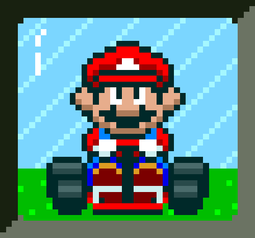
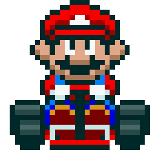
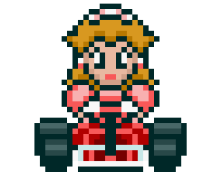
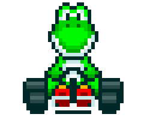
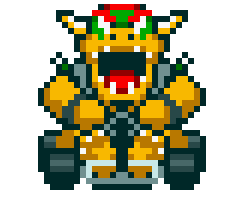
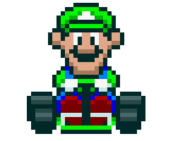
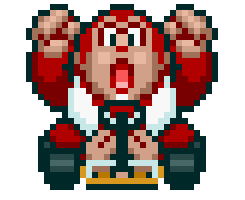

<h1>Desafio de projeto do Felipão: Mario Kart.JS</h1>

  <table>
        <tr>
            <td>
                
            </td>
            <td>
                <b>Objetivo:</b>
                
Mario Kart é uma série de jogos de corrida desenvolvida e publicada pela Nintendo. Nosso desafio será criar uma lógica de um jogo de vídeo game para simular corridas de Mario Kart, levando em consideração as regras e mecânicas abaixo.

            </td>
        </tr>
    </table>

<h2>Players</h2>
      <table style="border-collapse: collapse; width: 800px; margin: 0 auto;">
        <tr>
            <td style="border: 1px solid black; text-align: center;">
                
Mario

                
            </td>
            <td style="border: 1px solid black; text-align: center;">
                
Velocidade: 4

                
Manobrabilidade: 3

                
Poder: 3

            </td>
             <td style="border: 1px solid black; text-align: center;">
                
Peach

                
            </td>
            <td style="border: 1px solid black; text-align: center;">
                
Velocidade: 3

                
Manobrabilidade: 4

                
Poder: 2

            </td>
              <td style="border: 1px solid black; text-align: center;">
                
Yoshi

                
            </td>
            <td style="border: 1px solid black; text-align: center;">
                
Velocidade: 2

                
Manobrabilidade: 4

                
Poder: 3

            </td>
        </tr>
        <tr>
            <td style="border: 1px solid black; text-align: center;">
                
Bowser

                
            </td>
            <td style="border: 1px solid black; text-align: center;">
                
Velocidade: 5

                
Manobrabilidade: 2

                
Poder: 5

            </td>
            <td style="border: 1px solid black; text-align: center;">
                
Luigi

                
            </td>
            <td style="border: 1px solid black; text-align: center;">
                
Velocidade: 3

                
Manobrabilidade: 4

                
Poder: 4

            </td>
            <td style="border: 1px solid black; text-align: center;">
                
Donkey Kong

                
            </td>
            <td style="border: 1px solid black; text-align: center;">
                
Velocidade: 2

                
Manobrabilidade: 2

                
Poder: 5

            </td>
        </tr>
    </table>

<h3>🕹️ Regras & mecânicas:</h3>

<b>Jogadores:</b>

<input type="checkbox" id="jogadores-item" />
<label for="jogadores-item">O Computador deve receber dois personagens para disputar a corrida em um objeto cada</label>

<b>Pistas:</b>

<ul>
  <li><input type="checkbox" id="pistas-1-item" /> <label for="pistas-1-item">Os personagens irão correr em uma pista aleatória de 5 rodadas</label></li>
  <li><input type="checkbox" id="pistas-2-item" /> <label for="pistas-2-item">A cada rodada, será sorteado um bloco da pista que pode ser uma reta, curva ou confronto</label>
    <ul>
      <li><input type="checkbox" id="pistas-2-1-item" /> <label for="pistas-2-1-item">Caso o bloco da pista seja uma RETA, o jogador deve jogar um dado de 6 lados e somar o atributo VELOCIDADE, quem vencer ganha um ponto</label></li>
      <li><input type="checkbox" id="pistas-2-2-item" /> <label for="pistas-2-2-item">Caso o bloco da pista seja uma CURVA, o jogador deve jogar um dado de 6 lados e somar o atributo MANOBRABILIDADE, quem vencer ganha um ponto</label></li>
      <li><input type="checkbox" id="pistas-2-3-item" /> <label for="pistas-2-3-item">Caso o bloco da pista seja um CONFRONTO, o jogador deve jogar um dado de 6 lados e somar o atributo PODER, quem perder, perde um ponto</label></li>
      <li><input type="checkbox" id="pistas-2-3-item" /> <label for="pistas-2-3-item">Nenhum jogador pode ter pontuação negativa (valores abaixo de 0)</label></li>
    </ul>
  </li>
</ul>

<b>Condição de vitória:</b>

<input type="checkbox" id="vitoria-item" />
<label for="vitoria-item">Ao final, vence quem acumulou mais pontos</label>
